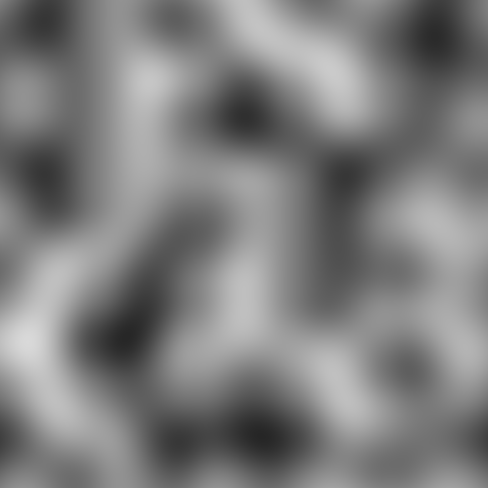
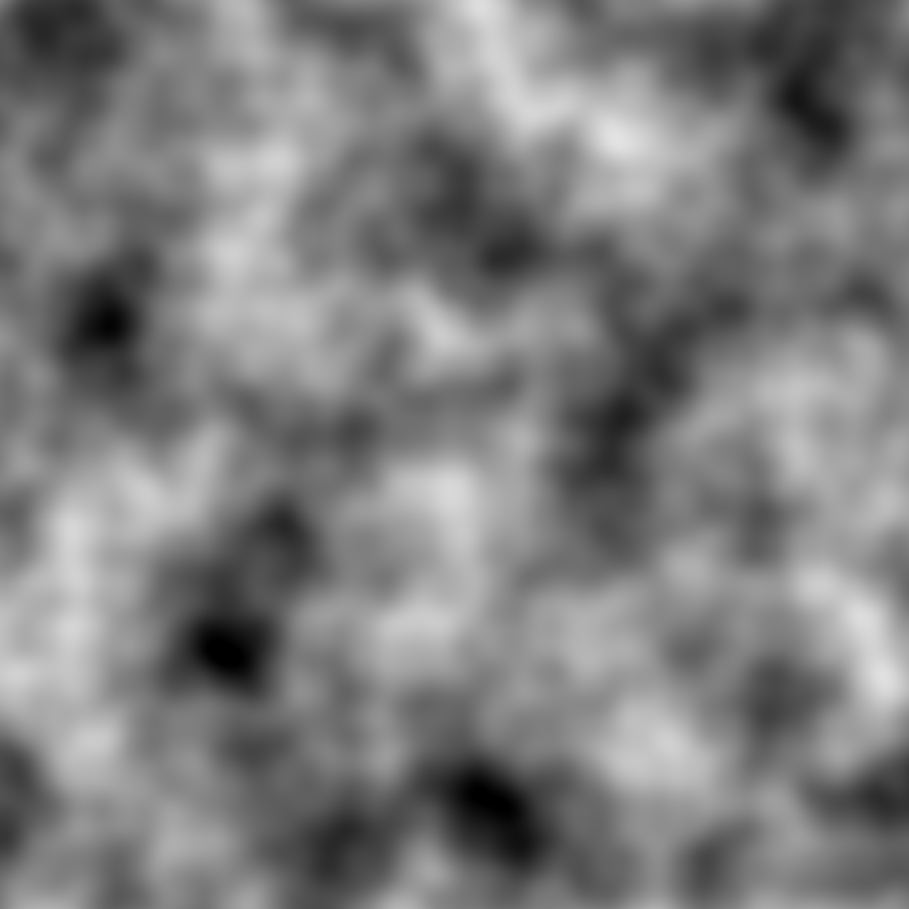
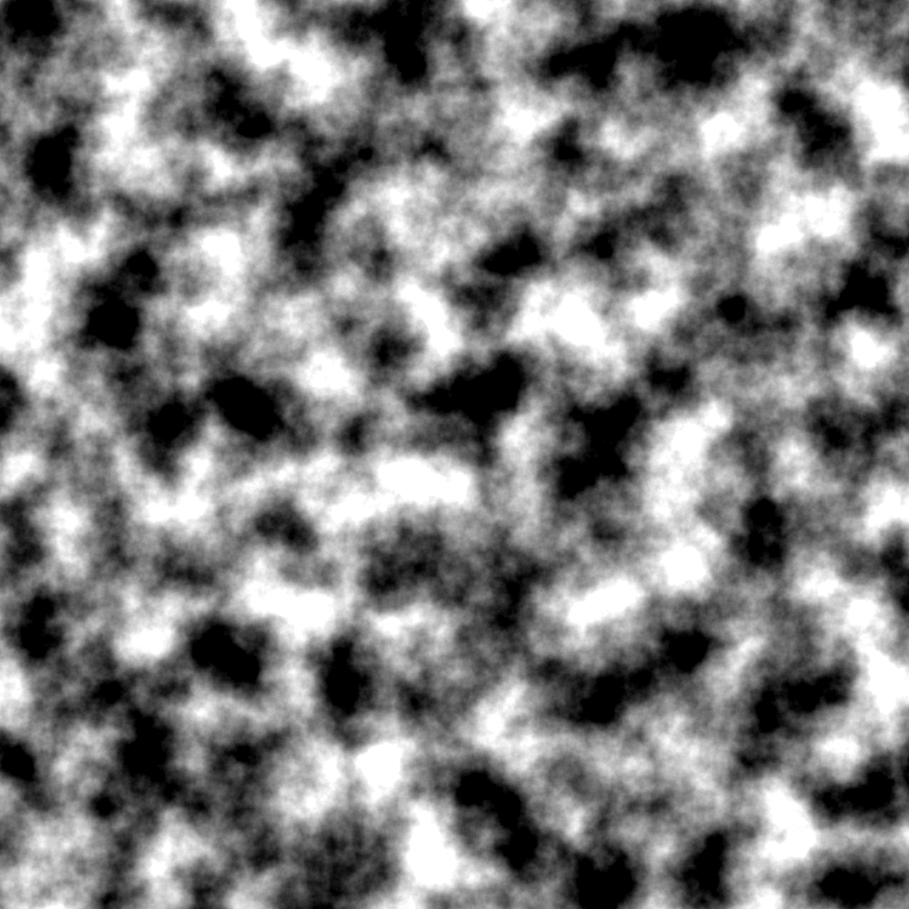

<div align="center">

  
  
  
  
  
  
  <br/>
  
  
  

```
              .__                                         .___       
  ____   ____ |__| _________.__.           ____  __ __  __| _/____   
 /    \ /  _ \|  |/  ___<   |  |  ______ _/ ___\|  |  \/ __ |\__  \  
|   |  (  <_> )  |\___ \ \___  | /_____/ \  \___|  |  / /_/ | / __ \_
|___|  /\____/|__/____  >/ ____|          \___  >____/\____ |(____  /
     \/               \/ \/                   \/           \/     \/ 
```
A high-performance Perlin noise generator developed for the "Accelerated Processing Systems - M" course at University of Bologna, with the professors **Stefano Mattoccia** and **Fabio Tosi**.
</div>


## Features

- **Multi-platform**: CPU and CUDA GPU acceleration support
- **Flexible output**: Multiple output formats (PNG, RAW, CSV, PPM)
- **Customizable parameters**: Adjustable octaves, image size, and seed
- **High performance**: Optimized noise generation algorithms

## Available Backends and Versions

| Backend | Available Versions | Description                           | Dependencies |
|---------|--------------------|---------------------------------------|--------------|
| CUDA    | v1, v2, v3         | It uses  CUDA implementation          | CUDA         |
| SIMD    | v1                 | It uses SIMD instructions for ISA x86 | SSE4         |
| CPP     | v1, v2             | It is the naive C++ Implementation    | C++ compiler |

> Note: The `latest` keyword automatically selects the highest available version.

## Building

This project supports both CPU and GPU acceleration. CUDA toolkit is required for GPU acceleration, but you can also build for CPU-only execution.

### Build Tutorial

```sh
# Build CUDA backend
cmake -B build_cuda -DUSE_CUDA=ON -DCUDA_VERSION=v1
cmake --build build_cuda

# Build SIMD backend version v1
cmake -B build_simd -DUSE_SIMD=ON -DSIMD_VERSION=v1
cmake --build build_simd

# Build C++ backend (CPU only)
cmake -B build_cpp -DUSE_CPP=ON -DCPP_VERSION=v1
cmake --build build_cpp
```

> Tip: Use separate build directories per backend to avoid conflicts and unnecessary recompilation.
## Command-Line Options

| Flag | Long Option | Argument | Default | Description |
|------|-------------|----------|---------|-------------|
| `-h` | `--help` | none | — | Show this help message and exit. |
| — | `--version` | none | — | Show program version and exit. |
| `-o` | `--output` | `<filename>` | `perlin.<ext>` | Output filename. Extension inferred from format. |
| `-f` | `--format` | `<string>` | `png` | Output format. Supported: `png`, `raw`, `csv`, `ppm`. |
| `-s` | `--size` | `<WxH>` | `2048x2048` | Output size in pixels (width x height). |
| `-v` | `--verbose` | none | `false` | Print processing steps and timings. |
| `-n` | `--no-output` | `none` | `false` | Disable output file generation. |
| `-F` | `--frequency` | `<float>` | `1.0` | Base frequency (scale factor). |
| `-A` | `--amplitude` | `<float>` | `1.0` | Base amplitude. |
| `-L` | `--lacunarity` | `<float>` | `2.0` | Frequency multiplier per octave. |
| `-P` | `--persistence` | `<float>` | `0.5` | Amplitude multiplier per octave. |
| `-O` | `--offset` | `<x,y>` | `0,0` | Offset applied to noise coordinates. |
| `-C` | `--octaves` | `<int>` | `1` | Number of octaves (>= 1). |
| *positional* | *(seed)* | `<uint64>` | — | Positional unsigned integer seed (e.g. `./perlin 13813`). |
| `-b` | `--benchmark` | none | `false` | Generate CSV benchmark data. |

Usage: `./perlin [seed] [OPTIONS]`

## Output formats

- `PNG`: Portable Network Graphics (lossless compression)
- `RAW`: Raw binary data
- `CSV`: Comma-separated values

## Benchmarking notes 

If the `--benchmark` flag is set, the program will output benchmark data in CSV format to standard output, that includes:

```
timestamp,width,height,pixels,octaves,frequency,wall_ms,cpu_s,ms_per_pixel,mem_bytes
```

## Let's test it!

- All the output .csv files is in the directory `/tests/benchmarks/outputs/csv`. 

- The *Nsight Compute* outputs are in `/tests/benchmarks/outputs/cuda`. 

> **Note**: Ensure you have built the backend to test before running the benchmark tests. If you have compiled the project in a different build directory, adjust the script accordingly.

### C++: v1 vs. v2

To run the C++ benchmark test in v1 and v2, use the following command:

```sh
./tests/benchmarks/cpp_benchmark.sh
```

### Cuda: GPU timer

Incremental size of matrix, grouped by incremental number of octaves:

```sh
# Example: Test CUDA version 3
./tests/benchmarks/cuda_benchmark.sh 3
```

### Cuda: Nsight compute profiling

You need **NVIDIA Nsight Compute**, typically installed with the CUDA Toolkit. Installation (Arch Linux example): `sudo pacman -S nsight-compute`
> The profiling script uses `sudo` due to the need to access low-level GPU hardware counters. This is strongly discouraged for security reasons. Instead, ensure your user has the necessary permissions to access the device for profiling without `sudo`.

Use the provided script, supplying the integer version of the CUDA code to be tested.

```bash
# Example: Profile CUDA version 3
./tests/start-cuda-profiling-test.sh 3
```

## Plotting

- All the plotting Python scripts are in the directory `/tests/benchmarks/plots`. I was bored documenting them, feel free to explore and expand ;)

# Examples

Below are four example terrains generated with Perlin noise using seed `1234`.  
The output images are located in `docs/examples/png/`.

<table>
<tr>
  <td align="center">
    <br>
    <br>
    Freq: 5.0<br>
    Amp: 1.0<br>
    Lac: 2.0<br>
    Pers: 0.5<br>
    Octaves: 1
  </td>
  <td align="center">
    <br>
    <br>
    Freq: 5.0<br>
    Amp: 1.0<br>
    Lac: 2.0<br>
    Pers: 0.5<br>
    Octaves: 3
  </td>
  <td align="center">
    <br>
    <br>
    Freq: 10.0<br>
    Amp: 1.0<br>
    Lac: 2.0<br>
    Pers: 0.5<br>
    Octaves: 6
  </td>
  <td align="center">
    <br>
    <br>
    Freq: 10.0<br>
    Amp: 2.0<br>
    Lac: 2.0<br>
    Pers: 0.5<br>
    Octaves: 6
  </td>
</tr>
</table>


## License

This project is released under the **Apache License 2.0**. See LICENSE file for details.
